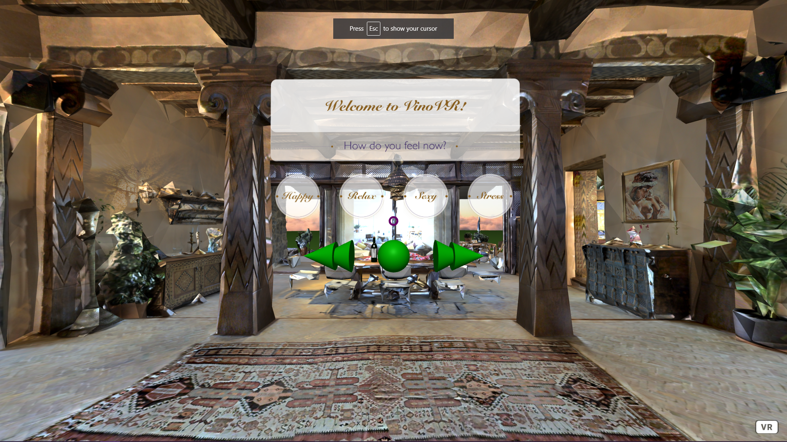

<h1 align="center">VinoVR-Experience</h1>  

A browser-based VR experience that allows you to enjoy a glass of wine, perhaps recommended on our portal site, in a scenic Mediterranean villa, with music that matches your mood.

## Table of Contents

- [Usage](#usage)
- [Roadmap](#roadmap)
- [Contributing](#contributing)
- [Authors](#authors)

## Usage

Simply navigate to the site and allow the VR experience to load

## Roadmap

In the future we would like to add the ability to access your account made on our portal site and see your saved wines, or get new suggestions, make more user friendly playlist functionality, and increase the quiality of the surrounding environment.

## Contributing
Pull requests are welcome. For major changes, please open an issue first to discuss what you would like to change.

## Authors

Grace Yang
Sean Weber

## License
[MIT](https://choosealicense.com/licenses/mit/)